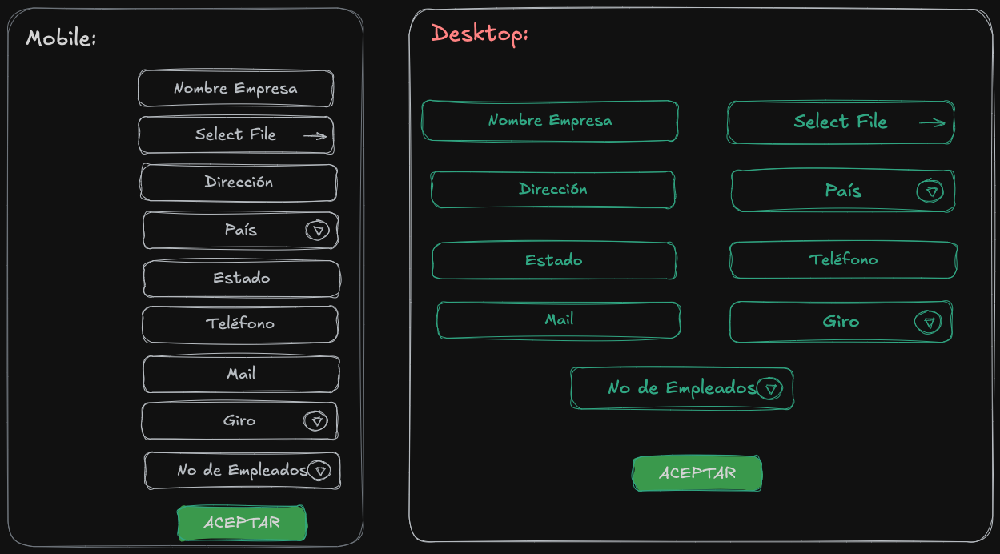

# Bootstrap template for login page.

## Objectives

- Create a login page using Bootstrap.
- Code all logic with JavaScript and jQuery.
- Use MySQL as database.

## 01/01/2025 - 18:57pm / 19:36pm - 39min

- [x] Make folder project structure.
- [x] Install necessary dependencies.
- [x] Create the html, css and js files.
- [x] Move node dependencies to inside the project folder.

---

## 01/02/2025 - 20:47pm / - 21:52pm - 1h 5min

- [x] Enable dark mode.
- [x] Put a background image.
- [x] Create a login form.
- [x] Convert into glassmorphism.

---

## 01/03/2025 - 21:24pm / - 21:30pm - 6min

- [x] Id's on html elements.

---

## 01/04/2025 - 09:10am / - 09:50am - 40min

- [x] Fix login styles.

---

## 01/05/2025 - 09:07am / - 09:37am - 30min

- [x] Fix button and background color.
- [x] Finish login form styles.

---

## 01/11/2025 - 13:06pm / - 18:58pm - 5h 52min

- [x] Due to errors in the login form, I will have to redo it.
- [x] Starting from scratch with the login form and mobile first.
- [x] Login form finished with mobile first.

---

## 12/01/2025 - 09:39am / - 2hr 20min

- [x] Create the database in the server.
- [x] Create the user table.
- [x] Create the db layer.
- [x] Research how to connect the database with the form.
- [x] Install mysql package.
- [x] Package mysql does not work, I will have to use another one.
- [x] I moved to the back4app package.
- [x] I managed to connect the database with the form.
- [x] Re write the login form with the new database connection.

---

## 13/01/2025 - 07:34pm / - 1hr

- [x] Fix the login form.
- [x] Optimize the dbLogin.js
- [x] Optimize Logic Layer.
- [x] Optimize Presentation Layer.

---

## 14/01/2025 - 06:28pm / - 32min

- [x] Create a mockup for the dashboard page, Starting with the sidebar.
- [x] Define the main actions that the user can perform.

---

## 15/01/2025 - 08:54pm / - 2hrs

- [x] Create the dashboard page.
- [x] Create all necessary files and folders.
- [x] Start the dashboard page with the sidebar.

**\* Note:** Accordion menu with icons needs to be created.

- [ ] Take testAccordion as a reference, the error was in the path of the bootstrap bundle.

---

## 16/01/2025 - 07:08pm / - 3hrs

- [x] Try again to create the accordion menu with icons.
- [x] Starting from scratch with the accordion menu.

---

## 19/01/2025 - 06:50pm / - 1hr

- [x] Finish the accordion menu with icons.
- [x] Give them the necessary styles.
- [x] Put the necessary links in the sidebar.
- [x] Design table and html elemnts for Empresa page.

- [x] Create the Empresa table.
- [x] Mockup for the Empresa page.

- [ ] Look up the carrousel element in bootstrap.
- [ ] Start web sketching with section for setup link.

---

## 20/01/2025 - 06:50pm / - 08:30pm - 1hr 40min

- [x] Create the Empresa file.
- [x] Into logic layer, make a funtion to validate the user and redirect as the parameter passed.
- [x] Modify the dashboard.js to use the redirect function.
- [x] Modify the sidebar to give all the ids necessary to the links.
- [x] Modify the sidebar an add the dashboard link.
- [x] Try to give the sidebar a module pattern.
- [x] Create the html files for the sidebar links.
- [x] Add all Dom elements to the sidebar module.

---

## 21/05/2025 - 06:00pm / - 19:44pm - 1hr 44min

- [x] In that page, create the table to list company data and 2 buttons to edit and delete.
- [x] Add a button to add a new company.

---

## 22/01/2025 - 06:10pm / - 7:07pm - 57min

- [x] Prettiest the table.
- [x] Modify the title or other section to show the company logo.

---

## 25/01/2025 - 08:10am / - 6hrs

- [x] Create the form to add a new company into a modal.
- [x] Modify the styles of the modal.
- [x] Create the form to edit a company into a modal.
- [x] Modify the styles of the modal.
- [x] Start the logic layer to add a new company.

---

## 26/01/2025 - 08:05am / - 9hrs

- [x] Finish the logic layer to add a new company.
- [x] Start the logic layer to edit a company.
- [x] Agregar los datos faltantes en la tabla de empresas con la opción de ocultar.
- [x] Start the logic layer to delete a company.
- [x] Start the logic layer to list all companies.

---

## 27/01/2025 - 05:50pm / - 2hrs 25min

- [x] Acompletar la funcion de editar para pasar los datos al modal.
- [x] Mostrar los datos en el modal.
- [x] Crear la función para editar los datos de la empresa.
- [x] Probar la edición de la empresa.
- [x] Arreglar el bug con el logo de la empresa.
- [x] Modificar la función de GetCompanies para que devuelva ordenado por fecha de creación.
- [x] Modificar la función de GetCompanies para que muestre el logo de la primera empresa de la tabla.

---

## 28/01/2025 - 06:05pm / - 2hr 36min

- [x] Start web sketching for user page.
- [x] Start logic layer for user page.
- [x] Show add user modal.
- [x] Create a function to fill the combo box with existing companies.
- [x] Create a function to add a new user.
- [x] Create a worker class.

---

## 29/01/2025 - 10:00pm / - 23min

- [x] Create Logic Layer for fill the table with users.
- [x] Create the function to get data from database.
- [x] Fill table with users.

---

## 30/01/2025 - 07:00pm / - 1hr 35min

- [x] Create the form to edit a user.
- [x] Get needed data to fill the form.

---

## 01/02/2025 - 10:15pm / - 1hr 25min

- [x] Create the function to fill select input empresas with values.
- [x] Add the logic and db layer to edit a user.

---

## 02/02/2025 - 08:50pm / - 1hr

- [x] Add the logic and db layer to delete a user.
- [x] Start web sketching for almacen page.
- [x] Start logic layer for almacen page.

---

## 03/02/2025 - 09:00am / - 3hr

- [x] Finish the logic layer for add a new almacen.
- [x] Create modal to edit a almacen.
- [x] Create logic layer to edit a almacen.
- [x] Create db layer to edit a almacen.
- [x] Create modal to delete a almacen.
- [x] Create logic layer to delete a almacen.
- [x] Create db layer to delete a almacen.

---

## 04/02/2025 - 06:10pm / - 1hr

- [x] Design Productos class.
- [x] Web sketching for productos page.
- [x] Install Chart.js
- [x] Create html productos page.
- [x] Start web sketching for productos page.

---

## 05/02/2025 - 09:15pm / - 30min

- [x] Modify the table to preserve the same style.
- [x] Add the agregar producto button.
- [ ] Follow the step by step guide from the Chart.js documentation.

---
